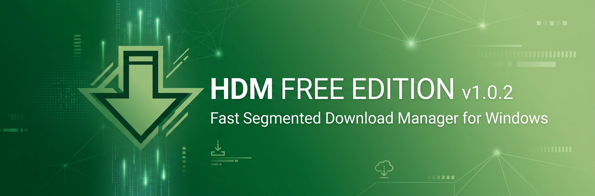
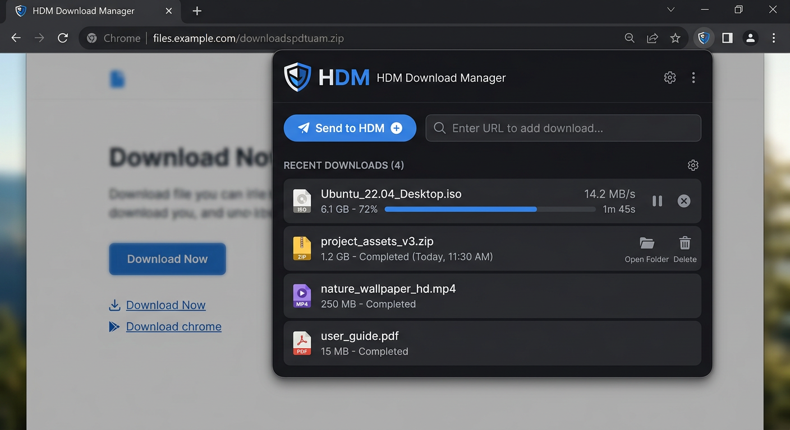

# Hami Download Manager (HDM) — FREE EDITION



<p align="center">
  
  
  
  
</p>

<p align="center">
  <b>Fast segmented download manager for Windows — IDM alternative</b><br/>
  ساخته شده توسط <b>HAMI SMART SYSTEMS</b> — از ۱۴۰۵/۰۷/۰۷ کاملاً رایگان
</p>

<p align="center">
  <a href="https://hamidesigns.shop/hdm/">🌐 Website</a> •
  <a href="https://github.com/hamismartsystems/Hami-Download-Manager/releases">📦 Releases</a> •
  <a href="#-features">✨ Features</a> •
  <a href="#-browser-extensions">🧩 Extensions</a>
</p>

---

### 🎉 FREE EDITION — از 2026-09-29

> **HDM اکنون کاملاً رایگان است** — بدون محدودیت سرعت، بدون نیاز به لایسنس

- `FREE_MODE = True` در `hdm_license.py` — نمایش `FREE EDITION — Lifetime` در About
- هیچ محدودیت 150KB/s وجود ندارد
- تمام لایسنس‌های قبلی غیرضروری شدند (اگر دارید همچنان کار می‌کند)

---

### 📸 Screenshots

| Main Window | Queue & Settings | Browser Integration |
|---|---|---|
|  |  |  |

---

### 🚀 Features

| ویژگی | توضیح |
|---|---|
| **Segmented Downloading** | هر فایل به 8 تکه (HTTP Range) تقسیم می‌شود، موازی دانلود و در **یک فایل** نوشته می‌شود — مثل IDM. هر تکه جداگانه resume می‌شود |
| **Smart Queue** | 1 تا 5 دانلود همزمان (پیش‌فرض **3**) — دکمه‌های `Pause Queue` / `Resume Queue` جدا از Pause هر فایل + `Start Now` (نادیده گرفتن زمان‌بندی) |
| **Resume Forever** | دانلودهای نیمه‌کاره ذخیره می‌شوند، بعد از ری‌استارت ادامه می‌یابند |
| **Scheduler** | فقط بین 02:00 تا 06:00 دانلود کن، یا `Start Now` بزن |
| **Smart Folders** | ذخیره خودکار در `Programs`, `Compressed`, `Video`, `Photo`, `Music`, `Documents`, `Others` داخل `~/Downloads/HDM` |
| **Clipboard Monitor** | لینک کپی شده را خودکار می‌گیرد — در استارت و کلیک روی آدرس بار — اختیاری: بلافاصله دانلود شروع شود |
| **System Tray** | اجرا در پس‌زمینه، شروع با ویندوز، بدون مزاحمت |
| **Bilingual** | English / فارسی — از Settings → Language |
| **Browser Extensions** | Chrome, Edge, Firefox — کلیک روی هر دکمه دانلود سایت → HDM تحویل می‌گیرد. اگر HDM خاموش باشد، مرورگر عادی دانلود می‌کند — چیزی گم نمی‌شود |

---

### 📦 Installation

#### Option 1 — Pre-built (recommended)
1. از [Releases](https://github.com/hamismartsystems/Hami-Download-Manager/releases) آخرین `HDM-1.0.2-Setup.exe` را دانلود کنید
2. نصب کنید — نیاز به Python ندارد

#### Option 2 — Run from source
```bash
git clone https://github.com/hamismartsystems/Hami-Download-Manager.git
cd Hami-Download-Manager
pip install PyQt6 requests
python hdm_gui.py
# or
run.bat
```

#### Build installer on Windows
```bat
build_windows.bat    :: -> dist\HDM-1.0.2\HDM-1.0.2.exe
build_installer.bat  :: -> installer\HDM-1.0.2-Setup.exe  (needs Inno Setup)
```
Requires: Python 3.10+, PyQt6, PyInstaller, Inno Setup 6

---

### 🧩 Browser Extensions

- Chrome / Edge: `chrome-extension/` → `chrome://extensions` → Developer mode → Load unpacked
- Firefox: `firefox-extension/` → `about:debugging` → This Firefox → Load Temporary Add-on

یا از فایل‌های آماده استفاده کنید:
- `hdm-chrome-extension.zip`
- `hdm-firefox-extension.zip`

راهنمای کامل فارسی: `راهنمای-نصب-افزونه-مرورگرها.txt`

> اگر HDM خاموش باشد، افزونه دخالت نمی‌کند — دانلود عادی مرورگر انجام می‌شود.

---

### ⚙️ How it works

```
User copies link → Clipboard monitor → HDM adds to queue
                → 8 HTTP Range requests in parallel
                → Writes to single .part file with offsets
                → On finish → Move to smart folder by extension
                → If paused / crash → Resume each segment individually
```

---

### 🆓 Free vs Old Trial

|  | Old Trial (تا 1405/07/06) | FREE EDITION (از 1405/07/07) |
|---|---|---|
| Price | 7 روز رایگان، بعد 150KB/s | **کاملاً رایگان** |
| License | `HG-XXXX-...` + قفل سخت‌افزار | نیازی نیست |
| Speed | محدود بعد از تریال | نامحدود |
| About | Trial — n days left | **FREE EDITION — Lifetime** |

---

### 📁 Project Structure

```
hdm_engine.py       # Core: segmented downloader, resume, queue
hdm_gui.py          # PyQt6 GUI, tray, clipboard, scheduler
hdm_license.py      # FREE_MODE=True — no check needed
hdm_server.py       # Local HTTP server for browser extensions (127.0.0.1:17432)
chrome-extension/   # Chrome/Edge extension
firefox-extension/  # Firefox extension
hdm-activate-server/# Optional legacy activation server (not needed for FREE)
```

---

### 🤝 Contributing

GPL-3.0 — Pull requests welcome!

1. Fork
2. Create branch `feat/your-feature`
3. Commit + Push
4. Open PR

---

### 📄 License

**GPL-3.0** — See [LICENSE](LICENSE)

© HAMI SMART SYSTEMS — https://hamidesigns.shop

---

### 🔗 Links

- Website: https://hamidesigns.shop/hdm/
- Store: https://hamidesigns.shop/apps/
- GitHub Org: https://github.com/hamismartsystems
- Support: https://t.me/Hami_Smart_Systems

<p align="center">
  <b>اگر HDM به دردت خورد ⭐ بده تا بقیه هم پیداش کنند</b>
</p>
