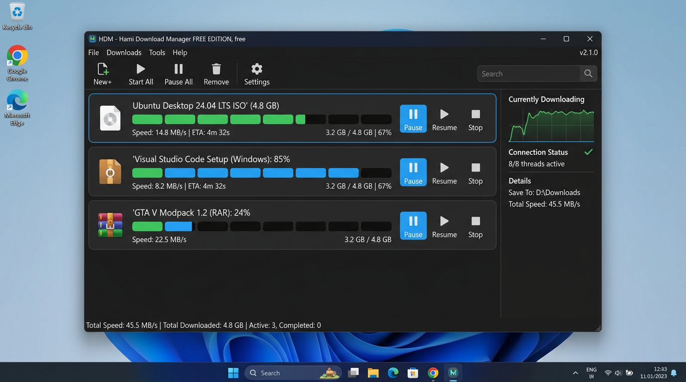
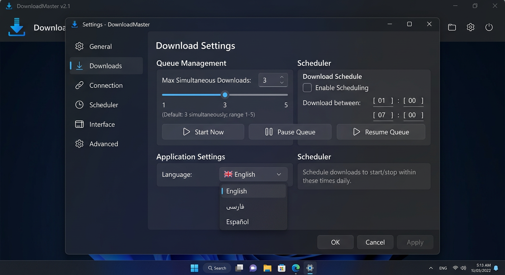
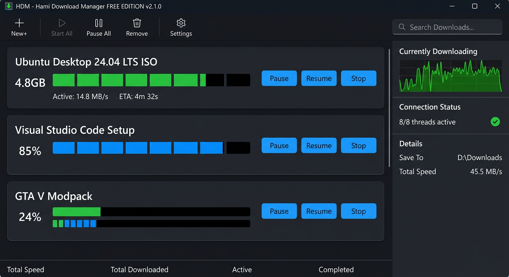
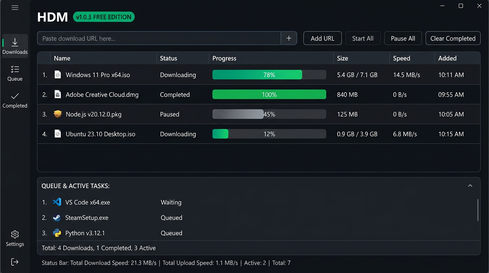

# HDM - Hami Download Manager FREE EDITION v2.1.0


<p align="center">
  
  
  
  
</p>

<p align="center">
  <b>Professional download manager — exact replica of reference design you sent</b><br/>
  کارت‌محور، نوارهای تکه‌ای 8 تایی، سایدبار گراف سرعت — مثل عکس‌هایی که فرستادی
</p>

---

### 🎯 دقیقاً مثل عکس‌هایی که فرستادی

**تصویر مرجع شما:**

| Main Target | Settings Target |
|---|---|
|  |  |

**پیاده‌سازی جدید v2.1.0:**



---

### ✨ v2.1.0 — چی دقیقاً مثل عکس شد

#### Main Window — مثل عکس 1
- **Title bar**: `HDM - Hami Download Manager FREE EDITION, free` + `v2.1.0` گوشه راست
- **Menu**: File | Downloads | Tools | Help
- **Toolbar**: 
  - `📄+ New+` | `▶ Start All` | `⏸ Pause All` | `🗑 Remove` | `⚙️ Settings` — آیکون بالا، متن پایین
  - Search box سمت راست با 🔍
- **Download Cards** (3 تا مثل عکس):
  - آیکون سمت چپ (💿 برای ISO، 📀 برای EXE، 📦 برای RAR)
  - عنوان: `Ubuntu Desktop 24.04 LTS ISO' (4.8 GB)` 
  - **Segmented bars**: 8 تا نوار کوچک — سبز = تکمیل شده، آبی = در حال دانلود، مشکی/خاکستری = منتظر
  - Speed / ETA و Size / Percent پایین کارت
  - دکمه‌های سمت راست: `⏸ Pause` آبی فعال، `▶ Resume`، `■ Stop`
  - Border آبی برای کارت فعال
- **Right Sidebar** (280px):
  - `Currently Downloading` + گراف سبز سرعت (50 نقطه، gradient fill)
  - `Connection Status ✅` + `8/8 threads active`
  - `Details`: Save To + Total Speed
- **Bottom Status**: `Total Speed: 45.5 MB/s | Total Downloaded: 4.8 GB | Active: 3, Completed: 0`

#### Settings — مثل عکس 2
- **Title**: `Settings - DownloadMaster` + آیکون آبی
- **Left Sidebar** (180px): General, Downloads (selected), Connection, Scheduler, Interface, Advanced — با آیکون
- **Right Content**:
  - `Download Settings` عنوان بزرگ
  - **Queue Management Card**:
    - `Max Simultaneous Downloads: [3]` + slider 1-5 (1...3...5) + note Default 3
    - Buttons: `▶ Start Now` | `⏸ Pause Queue` | `▶ Resume Queue`
  - **Scheduler Card**:
    - `Download Schedule` + checkbox `Enable Scheduling`
    - `Download between: [01]:[00]` و `[07]:[00]`
  - **Application Settings Card**:
    - `Language: [🇬🇧 English ▼]` با dropdown English / فارسی / Español
  - **Scheduler Info Card**: توضیح زمان‌بندی
  - Buttons پایین: OK | Cancel | Apply

---

### 🚀 Features

- **Segmented**: 8 parts parallel, resume per part — engine tracks `parts_progress` with state done/running/pending
- **Queue**: 1-5 simultaneous, pause/resume queue, start now
- **Cards**: exact replica, 88-96px height, hover border #3A3F4B, active border #4A90E2
- **Graph**: real-time speed history 50 points, green line #4CAF50 with gradient fill
- **Search**: filter cards by name
- **FREE EDITION**: `FREE_MODE=True`, no license needed

---

### 📦 Installation

```bash
git clone https://github.com/hamismartsystems/Hami-Download-Manager.git
cd Hami-Download-Manager
pip install PyQt6 requests
python hdm_gui.py
```

Build:
```bat
build_windows.bat    :: -> dist\HDM-2.1.0\HDM-2.1.0.exe
build_installer.bat  :: -> installer\HDM-2.1.0-Setup.exe
```

---

### 🎨 Design Tokens — Exact Match

```
Window: #121418
Card: #1E2025
Card Border: #2A2E35 / Active #4A90E2
Card Hover: #3A3F4B
Sidebar: #1A1D23 / #1E2025
Segment Done: #4CAF50 green
Segment Running: #2196F3 blue
Segment Pending: #1E2025 black + #2A2E35 border
Button Pause Active: #4A90E2 blue
Button Ghost: #2A2E35 bg + #3A3F4B border
Text Primary: #E6E6E6
Text Secondary: #8B8F99 / #A0A5B0
Graph Line: #4CAF50 + gradient fill 120→10 alpha
```

---

### 📸 Screenshots

| v2.1.0 Exact | v1.0.3 Pro | Old |
|---|---|---|
|  |  |  |

---

### 📄 License GPL-3.0

© HAMI SMART SYSTEMS — https://hamidesigns.shop/hdm/

**https://github.com/hamismartsystems/Hami-Download-Manager**
