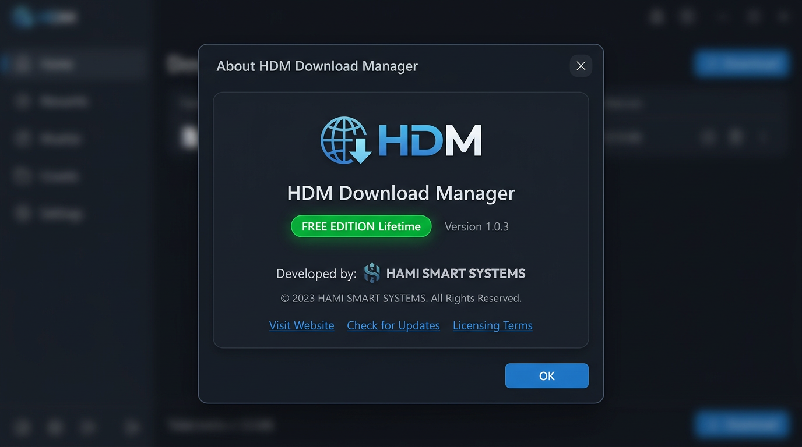

# Hami Download Manager (HDM) — FREE EDITION v1.0.3 Pro UI


<p align="center">
  
  
  
  
  
</p>

<p align="center">
  <b>Fast segmented download manager for Windows — IDM alternative — Professional Dark UI</b><br/>
  ساخته شده توسط <b>HAMI SMART SYSTEMS</b> — از ۱۴۰۵/۰۷/۰۷ کاملاً رایگان — v1.0.3 با ظاهر حرفه‌ای جدید
</p>

<p align="center">
  <a href="https://hamidesigns.shop/hdm/">🌐 Website</a> •
  <a href="https://github.com/hamismartsystems/Hami-Download-Manager/releases">📦 Releases</a> •
  <a href="#-whats-new-in-v103-pro-ui">✨ What's New</a> •
  <a href="#-screenshots">📸 Screenshots</a>
</p>

---

### 🎉 FREE EDITION — از 2026-09-29

> **HDM اکنون کاملاً رایگان است** — بدون محدودیت سرعت، بدون نیاز به لایسنس

- `FREE_MODE = True` در `hdm_license.py` — نمایش `FREE EDITION — Lifetime`
- هیچ محدودیت 150KB/s وجود ندارد

### ✨ What's New in v1.0.3 Pro UI

| قبل (v1.0.2) | الان (v1.0.3 Pro) |
|---|---|
| تم ساده `#0c1116` | **GitHub Dark Pro** `#0D1117` + کارت `#161B22` + حاشیه `#21262D` |
| Badge ساده | **Badge سبز pill** `FREE EDITION — Lifetime` با border `#2EA043` |
| Progress bar ضخیم 14px | **گرادینت باریک 8px** `#00A86B → #00D084` گرد 6px |
| جدول ساده | **48px row height**, hover `#161B22`, انتخاب `#1F3A2E` |
| دکمه‌های خام | **Ghost + Accent** گرد 10px + آیکون‌های پرو ➕ 📁 ⏸ ▶ ✕ 🧹 ⚡ 🚀 |
| About ساده | **کارت header** + badge + استایل pro |
| پنجره 900x620 | **1080x720** مینیمم 960x640 — فضای حرفه‌ای |

**طراحی الهام گرفته از GitHub Dark + IDM + HAMI سبز #00A86B**

---

### 📸 Screenshots — Pro UI v1.0.3

| Main Window Pro | Queue & Settings Pro | Browser Integration | About Pro |
|---|---|---|---|
|  |  |  |  |

<details>
<summary>Old screenshots v1.0.2 (click to expand)</summary>

| Main Old | Queue Old |
|---|---|
|  |  |

</details>

---

### 🚀 Features

| ویژگی | توضیح |
|---|---|
| **Segmented Downloading** | هر فایل 8 تکه (HTTP Range) موازی → یک فایل نهایی — مثل IDM |
| **Smart Queue** | 1-5 همزمان (پیش‌فرض 3) — Pause/Resume Queue جدا + Start Now |
| **Resume Forever** | بعد از ری‌استارت ادامه می‌یابد |
| **Scheduler** | فقط بین ساعات خاص |
| **Smart Folders** | Programs, Compressed, Video, Photo, Music, Documents, Others |
| **Clipboard Monitor** | لینک کپی → خودکار اضافه |
| **System Tray** | پس‌زمینه + شروع با ویندوز |
| **Bilingual** | English / فارسی |
| **Browser Extensions** | Chrome, Edge, Firefox — اگر HDM خاموش باشد مرورگر عادی دانلود می‌کند |

---

### 📦 Installation

#### Pre-built
1. از [Releases](https://github.com/hamismartsystems/Hami-Download-Manager/releases) آخرین `HDM-1.0.3-Setup.exe` دانلود
2. نصب — نیاز به Python ندارد

#### From source
```bash
git clone https://github.com/hamismartsystems/Hami-Download-Manager.git
cd Hami-Download-Manager
pip install PyQt6 requests
python hdm_gui.py
```

#### Build on Windows
```bat
build_windows.bat    :: -> dist\HDM-1.0.3\HDM-1.0.3.exe
build_installer.bat  :: -> installer\HDM-1.0.3-Setup.exe  (needs Inno Setup)
```

---

### 🧩 Browser Extensions

- Chrome/Edge: `chrome://extensions` → Developer mode → Load unpacked → `chrome-extension/`
- Firefox: `about:debugging` → Load Temporary Add-on → `firefox-extension/`

فایل آماده: `hdm-chrome-extension.zip`, `hdm-firefox-extension.zip`
راهنما: `راهنمای-نصب-افزونه-مرورگرها.txt`

---

### 🎨 Design System — Pro UI

```
Background: #0D1117 (GitHub Dark)
Card:       #161B22
Border:     #21262D / #30363D
Text:       #E6EDF3 / #C9D1D9 / #8B949E
Accent:     #00A86B → #00D084 gradient
Accent Btn: #238636 → #2EA043 hover
Free Badge: #1F3A2E bg + #56D364 text + #2EA043 border
Progress:   8px height, 6px radius, gradient green
Table Row:  48px, rounded 12px container
Buttons:    10px radius, 36-44px height, ghost + accent
Font:       Segoe UI / Inter, 13px, 500-800 weights
```

---

### 📁 Structure

```
hdm_engine.py       # Core segmented downloader
hdm_gui.py          # Pro UI — PyQt6, GitHub Dark, 1080x720, badge, icons
hdm_license.py      # FREE_MODE=True
hdm_server.py       # Local server for extensions 127.0.0.1:17432
screenshots/        # Pro UI screenshots + banner
chrome-extension/   # Chrome/Edge
firefox-extension/  # Firefox
```

---

### 📄 License

**GPL-3.0** — See [LICENSE](LICENSE)
© HAMI SMART SYSTEMS — https://hamidesigns.shop

---

### 🔗 Links

- Website: https://hamidesigns.shop/hdm/
- Store: https://hamidesigns.shop/apps/
- GitHub: https://github.com/hamismartsystems
- Support: https://t.me/Hami_Smart_Systems

<p align="center">
  <b>اگر HDM به دردت خورد ⭐ بده — ظاهر جدید پرو رو دوست داشتی؟</b><br/>
  v1.0.3 Pro UI — حرفه‌ای مثل IDM، رایگان برای همیشه
</p>
